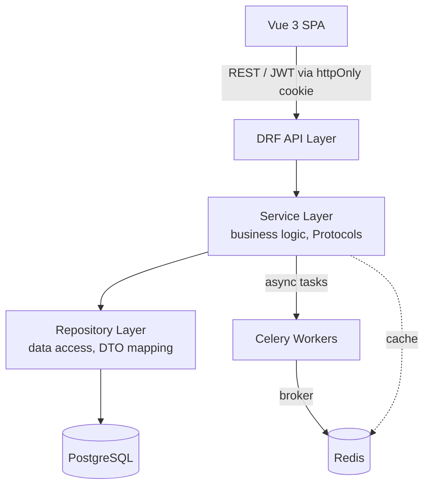

<div align="center">

# UkrKolo — Modular Monolith Backend

**A production-grade forum & marketplace platform built with Django/DRF and clean architecture.**

[]()
[]()
[]()
[]()
[]()

[~~Live Demo~~](https://ukrkolo.site) · [Report Bug](../../issues) · [Request Feature](../../issues)

<br>

[🇺🇦 Українська](README.md) · 🇬🇧 **English**

</div>

<br>

<p align="center">
  
</p>

<br>

## About

UkrKolo is a full-featured forum and marketplace platform, built as a **modular monolith** with clean architecture principles — designed to be simple to run today and easy to split into services later. The project started as a personal deep-dive into production-grade backend engineering and is now evolving toward a real product for the Ukrainian community.

**Why this project stands out:**
- Not a CRUD tutorial clone — implements Protocol-based contracts, service/repository layering, and DTO boundaries between layers
- Production observability: structured logging and Grafana/Loki dashboards for monitoring system health

<br>

## ✨ Key Engineering Decisions

| Challenge | Solution |
|---|---|
| Secure token storage without exposing tokens to JS | JWT auth via `httpOnly` cookies with custom `CookieJWTAuthentication` + CSRF enforcement |
| Cross-module search over heterogeneous entities | `SearchRegistry` / `SearchHandler` pattern for pluggable, module-agnostic search orchestration |
| Ukrainian-language full-text search | PostgreSQL GIN indexes with UA-aware text search configuration |
| Decoupling domain logic from persistence | Protocol-based contracts + repository/service layers, with separate `DTO` per use case |
| Partial updates without ambiguous "empty" values | PATCH sentinel pattern to distinguish "not provided" from "set to null" |
| Debugging production issues fast | Centralized JSON logging shipped via Promtail → Loki, visualized in Grafana |

<br>

## 🏗 Architecture



<sub>Modules: `users` · `household` · `files` · `shop` · `articles` · `search` — each self-contained with its own service/repository/DTO layers.</sub>

<br>

## 🛠 Tech Stack

**Backend:** Django, Django REST Framework, PostgreSQL, Redis, Celery

**Frontend:** Vue 3 (SPA), Axios (with refresh-token mutex pattern)

**Infra:** Docker, Docker Compose, nginx(planned), Gunicorn(planned)

**Observability:** Grafana, Loki, Promtail, Sentry

<br>

## 🚀 Quick Start

**1. Clone the repository**

```bash
git clone https://github.com/user-RC147/ukr-forum-rest.git
cd ukr-forum-rest
```

```bash
cp backend/.env.example backend/.env
# fill in the variables (see below)

docker compose up --build
```

| URL | Description |
|---|---|
| `http://localhost:5173` | Vue frontend |
| `http://localhost:8080/api/docs/` | Swagger docs |
| `http://localhost:8080/admin/` | Django admin panel |

<br>

## 📁 Project Structure

```
.
├── backend/
│   ├── apps/
│      ├── users/          # JWT auth, cookie handling
│      ├── household/      # home accounting
│      ├── files/          # module for file processing (including media data)
│      ├── shop/           # marketplace module
│      ├── articles/       # ask/answer module
│      └── search/         # cross-module search registry
│   ├── core/           # shared contracts and reusable code (DRY)
│   ├── config/         # django and others config
│   └── requirements/   # requirements for backend
├── frontend/           # all frontend for modules above
├── monitoring/         # observability
└── docs/               # architecture notes, diagrams
```

<br>

## 🗺 Roadmap

- [ ] Real-time chat between users
- [ ] Payment system integration

<br>