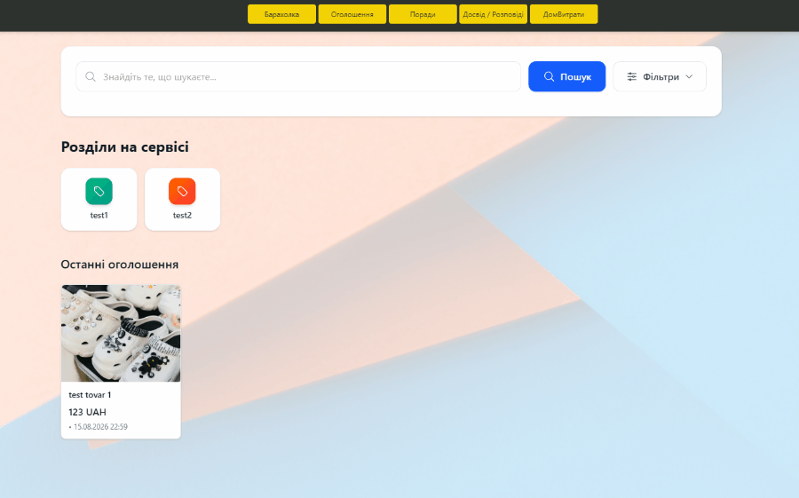
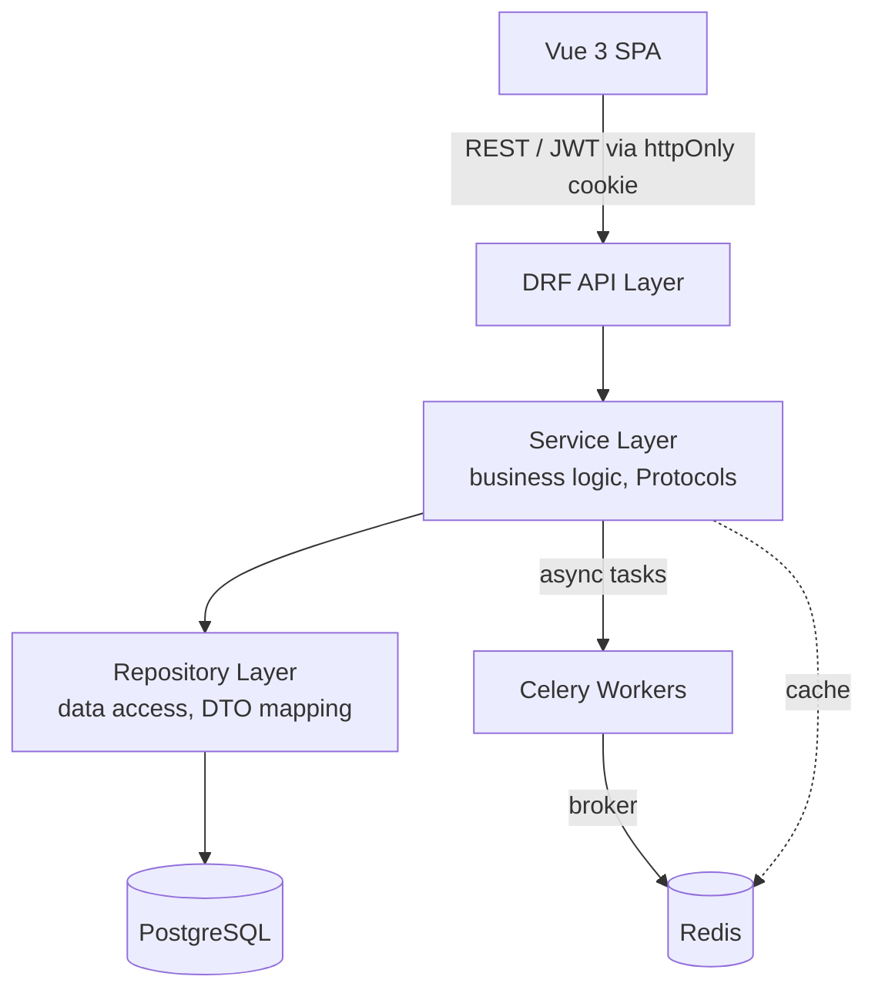

<div align="center">

# UkrKolo — Модульний моноліт (Backend)

**Продакшн-рівня платформа форуму та маркетплейсу на Django/DRF з чистою архітектурою.**

[]()
[]()
[]()
[]()
[]()

[~~Демо~~](https://ukrkolo.site) · [Повідомити про баг](../../issues) · [Запропонувати фічу](../../issues)

<br>

🇺🇦 **Українська** · [🇬🇧 English](README.en.md)

</div>

<br>

<p align="center">
  
</p>

<br>

## Про проєкт

UkrKolo — це повнофункціональна платформа форуму та маркетплейсу, побудована як **модульний моноліт** із принципами чистої архітектури — просто запускається зараз і легко розділяється на сервіси в майбутньому. Проєкт почався як особисте занурення в продакшн-інженерію бекенду, а зараз розвивається у реальний продукт для української спільноти.

**Чому цей проєкт вирізняється:**
- Це не CRUD-туторіал — реалізовані Protocol-based контракти, service/repository-шари та DTO-межі між шарами
- Продакшн-observability: структуроване логування та дашборди Grafana/Loki для моніторингу стану системи

<br>

## ✨ Ключові інженерні рішення

| Виклик | Рішення |
|---|---|
| Безпечне зберігання токена без доступу з JS | JWT-автентифікація через `httpOnly`-cookie з кастомним `CookieJWTAuthentication` + CSRF-захист |
| Крос-модульний пошук по різнорідних сутностях | Патерн `SearchRegistry` / `SearchHandler` для гнучкої, модуль-агностичної оркестрації пошуку |
| Повнотекстовий пошук українською | GIN-індекси PostgreSQL з text search конфігурацією під українську мову |
| Відв'язка бізнес-логіки від персистентності | Protocol-based контракти + service/repository-шари з окремим `DTO` під кожен use case |
| Часткові оновлення без неоднозначних "порожніх" значень | Патерн PATCH-sentinel для розрізнення "поле не передане" від "поле встановлене в null" |
| Швидка діагностика проблем у продакшені | Централізоване JSON-логування через Promtail → Loki, візуалізація в Grafana |

<br>

## 🏗 Архітектура



<sub>Модулі: `users` · `household` · `files` · `shop` · `articles` · `search` — кожен зі своїми service/repository/DTO-шарами.</sub>

<br>

## 🛠 Технологічний стек

**Backend:** Django, Django REST Framework, PostgreSQL, Redis, Celery

**Frontend:** Vue 3 (SPA), Axios (з refresh-token mutex-патерном)

**Infra:** Docker, Docker Compose, nginx(заплановано), Gunicorn(заплановано)

**Observability:** Grafana, Loki, Promtail, Sentry

<br>

## 🚀 Швидкий старт

**1. Клонувати репозиторій**

```bash
git clone https://github.com/user-RC147/ukr-forum-rest.git
cd ukr-forum-rest
```

```bash
cp backend/.env.example backend/.env
# заповнити змінні (див. нижче)

docker compose up --build
```

| URL | Опис |
|---|---|
| `http://localhost:5173` | Vue фронтенд |
| `http://localhost:8080/api/docs/` | Swagger документація |
| `http://localhost:8080/admin/` | Django адмін-панель |

<br>

## 📁 Структура проєкту

```
.
├── backend/
│   ├── apps/
│      ├── users/          # JWT-автентифікація, робота з cookie
│      ├── household/      # домашня бухгалтерія
│      ├── files/          # модуль обробки файлів (у т.ч. медіа)
│      ├── shop/           # модуль маркетплейсу
│      ├── articles/       # модуль питань/відповідей
│      └── search/         # крос-модульний пошуковий реєстр
│   ├── core/           # спільні контракти та перевикористовуваний код (DRY)
│   ├── config/         # конфігурація django та інших компонентів
│   └── requirements/   # залежності бекенду
├── frontend/           # весь фронтенд для модулів вище
├── monitoring/         # observability
└── docs/               # нотатки з архітектури, діаграми
```

<br>

## 🗺 Дорожня карта

- [ ] Чат між користувачами в реальному часі
- [ ] Інтеграція з платіжними системами

<br>